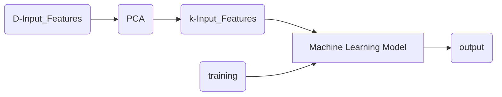

2026-02-23

Tags: [[Data Mining and Machine Learning]]
# Principle Component Analysis (PCA)
PCA is one of the more popular feature transform methods, it works by first projecting a vector x of D Input features to a vector z also of d input features. This projection minimizes information loss by maximizing variance. The projection of x is $z=xw^t$, where w maximizes the covariance of z. Notably the transformed features (z) are **not** a subset of the original features.

Where $K < D$

**Weakness:**
One of the weaknesses of PCA is that it assumes the features are linearly correlated. Linear correlation refers to straight-line relationships between two variables \[-1, 1\] with negative 1 as a perfect negative relationship and 0 as no correlation.  In typical ML applications, there is no linear relation between the input features. So, we apply a feature selection technique to reduce the number of features from d to k
# References
-  [[Dimensionality Reduction]]
- [[Variance and ST Deviation]]

