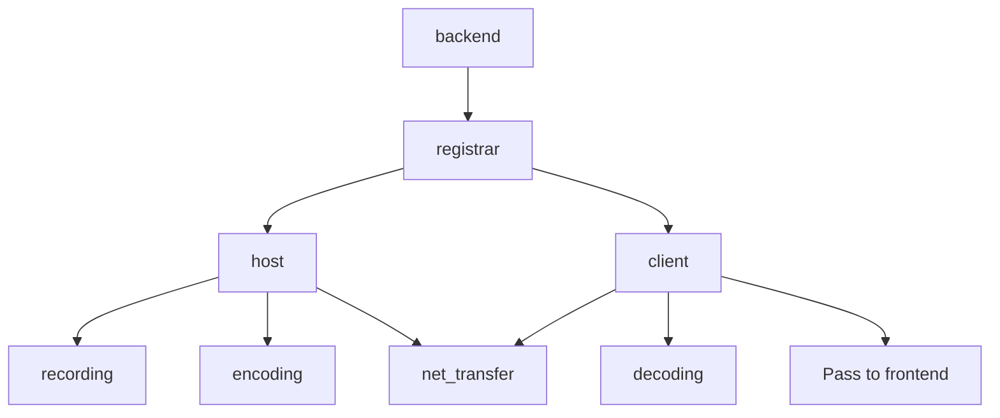
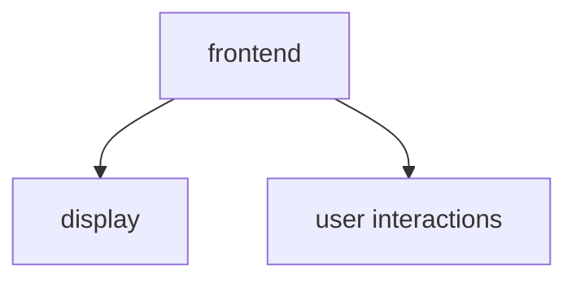

```mermaid
graph TD
    backend --> registrar
    registrar --> host
    registrar --> client
    host --> recording
    host --> encoding
    host --> net_transfer[net_transfer]
    client --> net_transfer[net_transfer]
    client --> decoding
	client --> front_pass[Pass to frontend]
```

```mermaid
graph TD
    frontend --> display
    frontend --> user_interactions[user interactions]
```

The fundamental idea behind the backend is a 